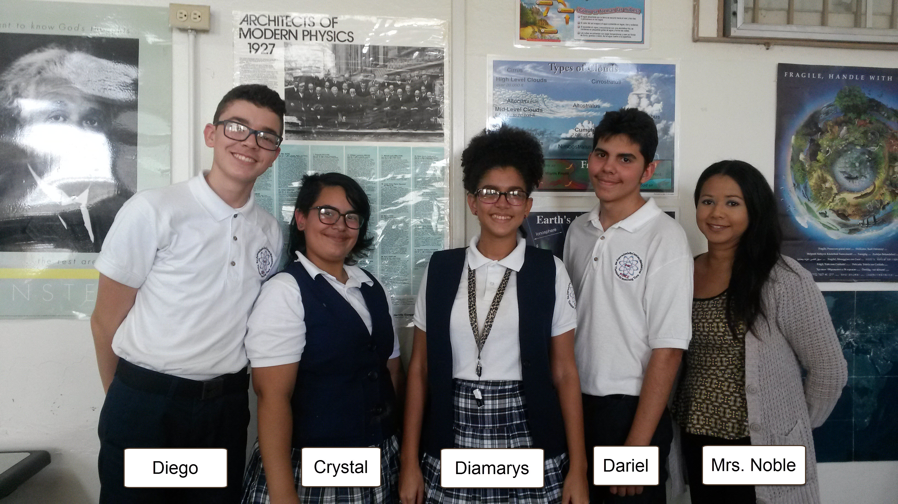
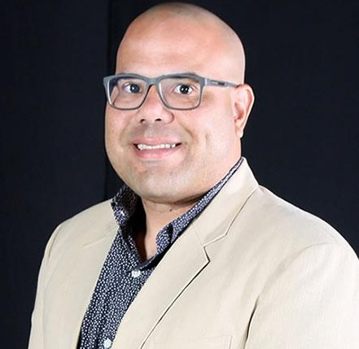
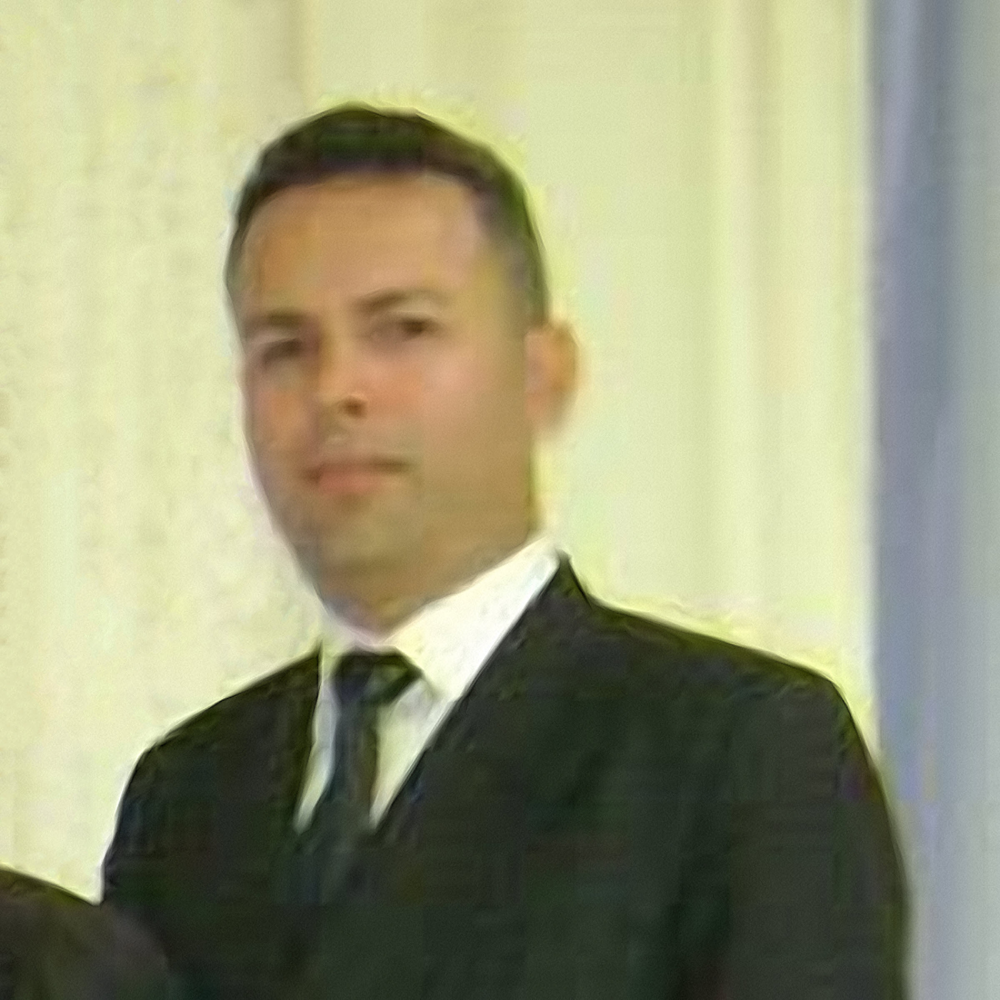

---
title: Who Are PRCubeStars?  
---  

[**Home**](https://friveramariani.github.io/PRCubeStars/) | [**Projects**](https://friveramariani.github.io/PRCubeStars/projects) | [**Updates**](https://friveramariani.github.io/PRCubeStars/updates) | [**Events**](https://friveramariani.github.io/PRCubeStars/images) | [**The CubeSat**](https://friveramariani.github.io/PRCubeStars/cubesat) | [**Fungal Spores**](https://friveramariani.github.io/PRCubeStars/fungi)

## Who Are PRCubeStars? 

##### Our Stars

- **Diamarys Salomé-Rivera**: 
	+ Sophomore, chemical engineering at the University of Puerto Rico - Mayagüez campus

- **Cristal L. Pérez-Pi**: 
	+ Sophomore, mechanical engineering at the University of Puerto Rico - Mayagüez campus

- **Dariel Torres-Velázquez**: 
	+ Freshman, mechanical engineering at the University of Puerto Rico - Mayagüez campus

- **Diego J.L. Vázquez-Santos**:
	+ Senior, Science and Math Specialized School Thomas Armstrong Toro, Ponce PR

- **Carmen Noble**, 
	+ *Physics Teacher and Mentor*, Science and Math Specialized School Thomas Armstrong Toro, Ponce PR

##### Mentors

 
***Félix E. Rivera-Mariani, PhD***: *Principal Investigator of PRCubeStars*. Dr. Rivera-Mariani is an immunologist, aerobiologist, and computational biological and non-biological data science expert. Originally from Arroyo, PR (same hometown and neighborhood as Dr. Sierra-Sastre (see below)), Dr. Rivera-Mariani was also an athlete in his hometown, representing Puerto Rico in international baseball competitions in the years 1990, 1993, and 1996. In 1996, Dr. Rivera-Mariani declined an offer by the Seattle Mariners to be drafted in the 25th round of the Major League Baseball amateur Draft to eventually follow his dream of playing Division-I collegiate baseball. He received an athletic scholarship from Southeastern Louisiana University, from where he earned a Bachelors in Science in Biology with a minor in Chemistry. After spending a few years working in an environmental laboratory ([EQ Lab](http://www.eqlab.com/)), he was accepted in graduate school, where he earned a PhD in Microbiology from the Department of Microbiology, School of Medicine of the University of Puerto Rico Medical Sciences Campus. He later applied and was accepted in a postdoctoral fellowship in environmental health sciences at the Johns Hopkins University School of Public Health, under the mentorship of [Dr. Patric Breysse](https://www.cdc.gov/about/leadership/leaders/ncehatsdr.html) and [Dr. Thomas Hartung](https://www.jhsph.edu/faculty/directory/profile/2308/thomas-hartung). In this fellowship, Dr. Rivera-Mariani was in charge of expanding the utility of human-based immunological assays to assess the potential respiratory health effects of airborne biological pollutants in different environmental settings. Dr. Rivera Mariani also completed fellowships in [Science Teaching](https://www.asm.org/index.php/science-teaching-fellows-course), and training in Computational Data Science and Genomic Data Science, Systems Biology, Bioinformatics, and Software Development in the R computer language (find more credentials [here](http://friveram.com/education/)). Currently, Dr. Rivera-Mariani is an Assistant Professor and Academic Director at the <a href="http://ularkin.org/college-of-biomedical-sciences/">College of Biomedical Sciences at Larkin University</a> and maintains active scientific collaborations to assess the immunotoxicology and respiratory health potential effects of fungal spores endemic in the tropics, such as the Caribbean region (find recent publications [here](http://friveram.com/publications/)). Click [here for additional bio of  Dr. Rivera-Mariani's](http://friveram.com/).
  

 
***Yajaira Sierra-Sastre, PhD***: *Mission Director of PRCubeStars*. Dr.  Yajaira Sierra-Sastre is a materials scientist, educator, and space enthusiast with fifteen years of research experience in academic, federal, and private institutions. Yajaira obtained her B.S. degree in Chemistry from the University of Puerto Rico and her PhD in Nanomaterials Chemistry from Cornell University. After graduation, Yajaira worked for two start-up companies in upstate New York, where she developed nanocoatings for the medical, military, renewable energy, and textile sectors.  In 2013, Yajaira served as the Chief Scientific Officer for HI-SEAS-I, a four-month long Mars analog mission funded by NASA. Her works in nanotechnology, educational outreach, and her aspirations to become the first Puerto Rican female astronaut have been featured in many local and international media outlets.  Please follow Yajaira’s [facebook page](https://www.facebook.com/YajairaSierraSastre/).   
  

 
***Daron Westly***: *Mission Specialist of PRCubeStars*.  Daron Westly is also an expert in nanotechnology with a B.S. in Electrical Engineering from University of South Florida and  M.Eng. in Electrical Engineering from Cornell University. His research trajectory has addressed the areas of x-ray zone plates, microfluidic cells, and electron beam lithography for nanoscale fabrication. His involvement with the Makers Movement, fabrication experience, and programming expertise have been fundamental for the PRCubeStars team. Daron is currently a research scientist at the [US National Institute of Standards and Technology](https://www.nist.gov/people/daron-westly). Daron is also a brave [marathon runner](http://www.marathonfoto.com/Proofs?PIN=E7V722&LastName=WESTLY).  
  

   
***Damaso Cardenales***: *Computer Science Expert and Mission Specialist of PRCubeStars*. Dámaso Cardenales-Colón is one of our computer science experts and an avid follower and supporter of the Maker Movement, including being an active member of [Makerspace Puerto Rico](https://www.facebook.com/Makerspacepr/?fref=ts). He is also an excellent mentor and leader, and has shared with the students of the PRCubeStars team lots of knowledge in hardware design, assembly, and Arduino programming. His leadership and mentoring have been extremely valuable in the success of the PRCubeStars Team. 
  

 
***Carlos Rodriguez***, *Computer Science Expert and Mission Specialist of PRCubeStars*. Carlos Rodríguez is one of the leaders of [Makerspace Puerto Rico](https://www.facebook.com/Makerspacepr/?fref=ts) and our other expert in computer sciences. His maker, design, assembly, and programming expertise has also been fundamental to the PRCubeStars team.

[Click here to return to the PRCubeStars main page](https://friveramariani.github.io/PRCubeStars/)

*Copyright 2017 PRCubeStars*