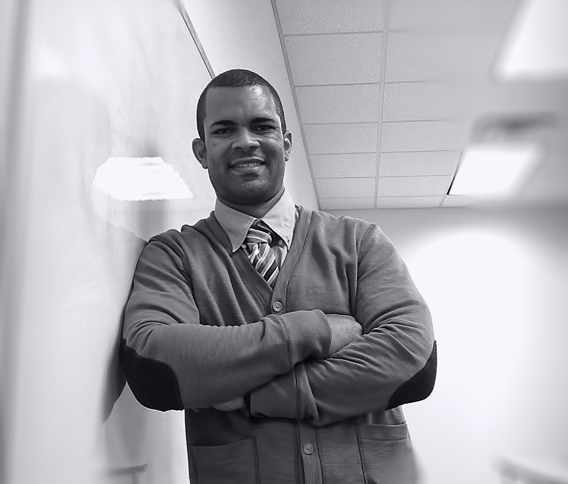

[**Home**](https://friveramariani.github.io/PRCubeStars/) | [**Projects**](https://friveramariani.github.io/PRCubeStars/projects) | [**Updates**](https://friveramariani.github.io/PRCubeStars/updates) | [**Images**](https://friveramariani.github.io/PRCubeStars/images)

##### Information about the PRCubeStars Team members

###### Our Stars

- **Diamarys Salomé Rivera**: 
	+ Sophmore, chemical engineering at the University of Puerto Rico - Mayagüez campus

- **Cristal L. Pérez-Pi**: 
	+ Sophmore, mechanical engineering at the University of Puerto Rico - Mayagüez campus

- **Dariel Torres-Velázquez**: 
	+ Freshman, mechanical engineering at the University of Puerto Rico - Mayagüez campus

- **Diego J.L. Vázquez-Santos**:
	+ Senior, Science and Math Specialized School Thomas Armstrong Toro, Ponce PR

- **Carmen Noble**, 
	+ *Physics Teacher and Mentor*, Science and Math Specialized School Thomas Armstrong Toro, Ponce PR

###### Mentors

 
**Félix E. Rivera-Mariani, PhD**: Principal Investigator
Dr. Rivera-Mariani is an immunologist, aerobiologist, and computational biological and non-biological data science expert. Originally from Arroyo, PR, same hometown and neighborhood as Dr. Sierra-Sastre (see below), was also an athlete in his hometown, representing Puerto Rico in international competitions in the years 1990, 1993, and 1996. In 1996, Dr. Rivera-Mariani declined an offer by the Seattle Mariners to be drafted in the 25th round to eventually followed his dream of playing Division-I collegiate baseball. He received an athletic scholarship from Southeastern Louisiana University, from where he earned a Bachelors in Science in Biology with a minor in Chemistry. After spending a few years working in an environmental laboratory ([EQ Lab](http://www.eqlab.com/)), he was accepted in graduate school, where he earned a PhD in Microbiology from the Department of Microbiology, School of Medicine of the University of Puerto Rico Medical Sciences Campus. He later applied and was accepted in a postdoctoral fellowship in environmental health sciences at the Johns Hopkins University School of Public Health, under the mentorship of [Dr. Patric Breysse](https://www.cdc.gov/about/leadership/leaders/ncehatsdr.html) and [Dr. Thomas Hartung](https://www.jhsph.edu/faculty/directory/profile/2308/thomas-hartung). In this fellowship, Dr. Rivera-Mariani was in charge of expanding the utility of human-based immunological assays to assess the potential respiratory health effects of airborne biological pollutants in different environmentla settings. Dr. Rivera Mariani also completed fellowships in [Science Teaching](https://www.asm.org/index.php/science-teaching-fellows-course), and training in Computational Data Science and Genomic Data Science, Systems Biology, Bioinformatics, and Software Development in the R language (find more credentials [here](http://friveram.com/education/)). Currently, Dr. Rivera-Mariani teaches at Miami Dade College and maintains active collaborations to assess the immunotoxicology and respiratory health potential effects of fungal spores endemic in the tropics, such as the Caribbean region (find recent publications [here](http://friveram.com/publications/)). Click [here for additional bio of  Dr. Rivera-Mariani's](http://friveram.com/).

 
**Yajaira Sierra-Sastre, PhD**: Mission Director
Dr. Sierra-Sastre, who is from the same neighborhood and went to the same high school (Carmen Bozello de Huyke, Arroy, PR) as Dr. Rivera-Mariani, is a nanotechnology scientist, excellent educator, science communicator, and mentor, with astronautical experience. In 2013, Dr. Sierra-Sastra was part of a six-person crew in the [HI-SEAS](https://en.wikipedia.org/wiki/HI-SEAS) project, in which the crew spent 4 months in a module simulating Mars conditions, and among the goals of the project was to determine ways to keep astrounats nourised while simulating a Mars expedition. She was selected among over 700 applicants and was the only Hispanic of the crew. She obtained her Bachelors of Science in Chemistry from the University of Puerto Rico, Mayaguez Campus. After working as a high teacher Chemistry teacher, she attended Cornell University, where she obtained her PhD in Materials Science and Nanotechnology ([source]( https://en.wikipedia.org/wiki/Yajaira_Sierra_Sastre)). You can find more information about Dr. Sierra-Sastre's bio (click [here for Dr. Sierra-Sastre's bio](https://en.wikipedia.org/wiki/Yajaira_Sierra_Sastre)). She also share interesting scientific and mentoring information in her [facebook page](https://www.facebook.com/YajairaSierraSastre/).

 
**Daron Westly**: Mission Specialist

(BS and MS degrees in Electrical Engineering from the University of South Florida and Cornell University, respectively)

 
**Damaso Cardenales**, *Computer Science Specialist* 

(computer science expert and member of [Makerspace Puerto Rico](https://www.facebook.com/Makerspacepr/?fref=ts))

 
**Carlos Rodriguez**, *Computer Science Specialist* (computer science expert and member of [Makerspace Puerto Rico](https://www.facebook.com/Makerspacepr/?fref=ts))

*Copyright 2017 PRCubeStars*