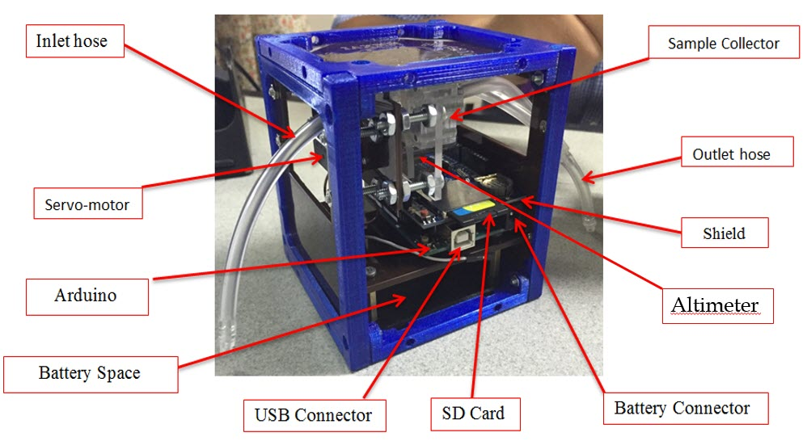

---
title: What is a CubeSat?
---  

[**Home**](https://friveramariani.github.io/PRCubeStars/) | [**Who Are PRCubeStars**](https://friveramariani.github.io/PRCubeStars/about) | [**Projects**](https://friveramariani.github.io/PRCubeStars/projects) | [**Updates**](https://friveramariani.github.io/PRCubeStars/updates) | [**Events**](https://friveramariani.github.io/PRCubeStars/images) | [**What are fungal spores?**](https://friveramariani.github.io/PRCubeStars/fungi)

## What is a CubeSat?

***The CubeSat***. This is our CubeSat, with all labeles on all the CubeSat's parts. 

***CubeSat's Sample Collector and Altimeter***. This image shows a close up of the CubeSat, including ***sample collector*** and the ***altimeter***. 

[Click here to return to the PRCubeStars main page](https://friveramariani.github.io/PRCubeStars/)

*Copyright 2017 PRCubeStars*