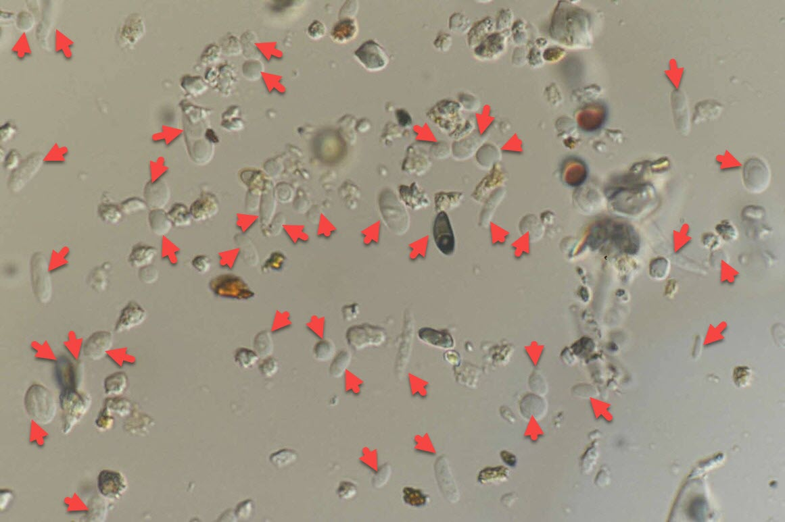

---
title: What are fungal spores?
---  

[**Home**](https://friveramariani.github.io/PRCubeStars/) | [**Who Are PRCubeStars**](https://friveramariani.github.io/PRCubeStars/about) | [**Projects**](https://friveramariani.github.io/PRCubeStars/projects) | [**Updates**](https://friveramariani.github.io/PRCubeStars/updates) | [**Events**](https://friveramariani.github.io/PRCubeStars/images) | [**The CubeSat**](https://friveramariani.github.io/PRCubeStars/cubesat) 

## What are fungal spores?

**Fungal spores** are the dispersal strucutres of fungi, which are organisms commonly known for decomposing dead organic matter (i.e. saprohytes) (find more information [here](https://www.researchgate.net/publication/255823215_Allergenicity_of_airborne_basidiospores_and_ascospores_Need_for_further_studies)). The role of spores among fungi is somewhat similar to the role of pollen in plants: contributing to their dispersal in the environment. Spores of fungi also have [cell walls](https://en.wikipedia.org/wiki/Cell_wall), which is another feature share with plants. As we may know, plants do not have the ability to move (contrary to animals) because of the cell wall: this is also the case for fungi. For this reason, pollen and spores are used by plants and fungi, respectively, for dispersal from one environment to another, including in the atmosphere of forest areas, inner-city and urban places, as well as inside buildings and occupational settings. Therefore, fungal spores are an [important biological component of the air we breath daily](https://www.researchgate.net/publication/226034160_Analysis_of_environmental_factors_and_their_effects_on_fungal_spores_in_the_atmosphere_of_a_tropical_urban_area_San_Juan_Puerto_Rico). See below an image of fungal spores from an air sample. 

***Fungal spores in an air sample***. *This image represents an air sample collected from the atmosphere of San Juan, Puerto Rico.  **The red arrows**  are pointing towards fungal spores. This image was captured at 1000X magnification by [Dr. Benjamín Bolaños-Rosero](https://md.rcm.upr.edu/micro/dt_team/dr-benjamin-bolanos/), from the University of Puerto Rico - Medical Sciences Campus. The Source of this image is the facebook page Alergia a Hongos (https://www.facebook.com/Alergia-a-Hongos-358948227553568/).*

Because fungal spores are an important biological component of the atmosphere we live and the air we breath, Dr. Félix E. Rivera-Mariani has been working since 2005 in various collaborative studies to elucidate the role of fungal spores in allergic respiratory diseases, such as allergic rhinitis and asthma. [Find here all published scientific articles of Dr. Rivera-Mariani](https://www.researchgate.net/profile/Felix_Rivera-Mariani/publications?sorting=newest&page=2), including those directly related to the study of fungal spores as important allergens. Among important findings of Dr. Rivera-Mariani collaborative studies include the following:

- fungal spores, not pollen, are the predominant biological particulate in Puerto Rico (find the published article [here](226034160_Analysis_of_environmental_factors_and_their_effects_on_fungal_spores_in_the_atmosphere_of_a_tropical_urban_area_San_Juan_Puerto_Rico))
- the population of Puerto Rico, and possibly the Caribbean basin, may be react to allergens not commonly tested during allergy diagnosis (find the related articles [here](https://www.researchgate.net/profile/Felix_Rivera-Mariani/publications?sorting=newest&page=2))
- elucidating their [inflammatory potential](https://www.researchgate.net/publication/259394381_Comparison_of_the_Interleukin-1-Inducing_Potency_of_Allergenic_Spores_from_Higher_Fungi_Basidiomycetes_in_a_Cryopreserved_Human_Whole_Blood_System)
- characterizing the [ecology of fungal spores in indoor environments in Puerto Rico](https://www.researchgate.net/publication/282348027_Mold_populations_and_dust_mite_allergen_concentrations_in_house_dust_samples_from_across_Puerto_Rico)
- characterizing [proteins from fungal spores with allergenic potential](https://www.researchgate.net/publication/312192282_Serological_Reactivity_and_Identification_of_IgE-Binding_Polypeptides_of_Ganoderma_applanatum_Crude_Spore_Cytoplasmic_Extract_in_Puerto_Rican_Subjects)
- among others findings, including ongoing projects that interphase biological sciences and computational biology

#### Why are we interested in collecting fungal spores in the stratosphere?
The main goal of the project, to detect fungal spores in the stratosphere, has important climate change (e.g. cloud formation), environmental, and human health relevance (e.g. affecting human respiratory health). There is evidence that fungal spores have the potential to be transported long distances in the trophosphere. Less is known about possible long-distance travel in the stratosphere. 

[Click here to return to the PRCubeStars main page](https://friveramariani.github.io/PRCubeStars/)

*Copyright 2017 PRCubeStars*

