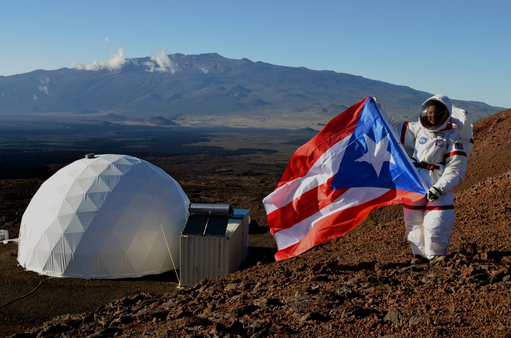
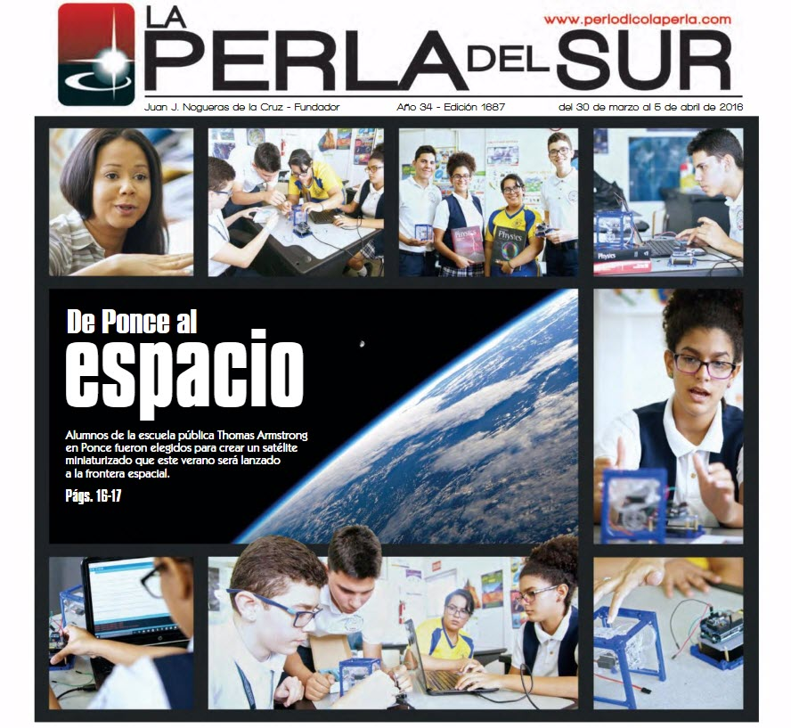

---
title: PRCubeStars Events
---  

[**Home**](https://friveramariani.github.io/PRCubeStars/) | [**Who Are PRCubeStars**](https://friveramariani.github.io/PRCubeStars/about) | [**Projects**](https://friveramariani.github.io/PRCubeStars/projects) | [**Updates**](https://friveramariani.github.io/PRCubeStars/updates) | [**The CubeSat**](https://friveramariani.github.io/PRCubeStars/cubesat) | [**Fungal Spores**](https://friveramariani.github.io/PRCubeStars/fungi)

## PRCubeStars Events

 
***PRCubeStars' Students at "El Parque de las Ciencias" (The Sciences Park)***: Students of PRCubeStars at “El Parque de las Ciencias” (The Sciences Park), in Bayamon, PR, sharing with the public their knowledge about nanosatellites (CubeSats) and talking about our team’s projects and updates. El Parque de las Ciencias is one of Puerto Rico’s main attractions, in which the public can learn about different science topics (find information [here](https://es-la.facebook.com/pdlcb/). **(August 6th, 2017)**

 
***High School Graduation of Dariel Torres***: High School Graduation of Dariel Torres, one of our students in the PRCubeStars Team. Dariel is now an engineering student at the [University of Puerto Rico - Mayagüez Campus](http://www.uprm.edu/portada/). **(June 2017)**

***Dr. Yajaira Sierra-Sastre with PRCubeStars' Students***: A visit by Dr. Yajaira Sierra-Sastre to PRCubeStars' students at the Thomas Armstrong Toro High School. Dra. Sierra-Sastre, Mission Director and one of our mentors in PRCubeStars, is an expert in nanotechnology, science communicator, and Mars analog missions. From left to right, students of PRCubeStars (Diego Vázquez-Santos, Dariel Torres-Velázquez, Diamarys Salomé-Rivera, Crystal Pérez-Pi), Dr. Sierra-Sastre, Mrs. Carmen Noble, and Dámaso Cardenales-Colón. **(June 25th, 2016)**

***Surprise Visit by Dr. Félix E. Rivera-Mariani***: Surprise visit by Dr. Félix E. Rivera-Mariani to students of PRCubeStars. Dr. Rivera-Mariani is the Principal Investigator of the PRCubeStars (find more information [here](https://friveramariani.github.io/PRCubeStars/about)). In this image, captured by Mrs. Gina Martinez-Rivera (wife of Dr. Rivera-Mariani), students are testing the air pump and its synchronization with the programming of the CubeSat's Arduino. **(April 15th, 2016)**

***Surprise Visit by Dr. Félix E. Rivera-Mariani***: Surprise visit by Dr. Félix E. Rivera-Mariani to PRCubeStars' students at the Thomas Armstrong Toro High School. From left to right, Dr. Rivera-Mariani, Diego Vázquez-Santos, Diamarys Salomé-Rivera, Mrs. Carmen Noble, Crystal Pérez-Pi, Dariel Torres-Velázquez, and Dámaso Cardenales-Colón. **(April 15th, 2016)**

***PRCubeStars' Students during the Arduino Day***: PRCubeStars’ Students during a presentation during the Arduino Day at the University of Puerto Rico Mayagüez Campus. They shared information about the PRCubeStars project with an audience, including students, professors, computer scientists, engineering experts, and members of the Maker movement. **(April 2nd, 2016)**

***Students Working on the CubeSat and being Mentored by Damaso Cardenales-Colón***: Find above a photo collage of students and mentor (Dámaso Cardenales-Colón) working on assembling and programming the CubeSat. **A)** Students receiving different parts for assembly of the CubeSat; **B)** the student Dariel Torres-Velázquez working on the assembly of the CubeSat's box; **C** students (Dariel Torres-Velázquez, in yellow shirt, next to Crystal Pérez-Pi; Diego Vázquez-Santos, with grey jacket, next to Diamarys Salomé-Rivera) working on programming the Arduino of the CubeSat with mentor Damaso Cardenales-Colón. **D)** Diamarys and Dariel working on the assembly of our CubeSat, including the sample collector, the Arduino and sensors; **E)** the Arduino of our CubeSat. 

***Dr. Yajaira Sierra Sastre in her Mars-Analog mission!***: Dr. Sierra-Sastre during her participation in the 4-months long Mars-analog mission, HI-SEAS (acronym for Hawaii Space Exploration Analog and Simulation). This six-crew mission, into which 700 applications were submitted and Dr. Sierra-Sastre was the only Hispanic in the crew, addressed nutritional strategies for deep-space explorations (photo credit: Dr. Sian Proctor).

***PRCubeStars' Students and Mentor (Mrs. Carmen Noble) on the cover page***. Very nice edition (March 30th, 2016) by [*La Perla Del Sur*](http://www.periodicolaperla.com/), which is a local newspaper in the city of Ponce, PR. Ponce is where the Thomas Armstrong Toro, a Math and Sciences specialized high school, is located. From this school, students and physics teacher Mrs. Carmen Noble were recruited to be part of the PRCubeStars team. **(March 30th, 2016)**

[Click here to return to the PRCubeStars main](https://friveramariani.github.io/PRCubeStars/)

*Copyright 2017 PRCubeStars*
