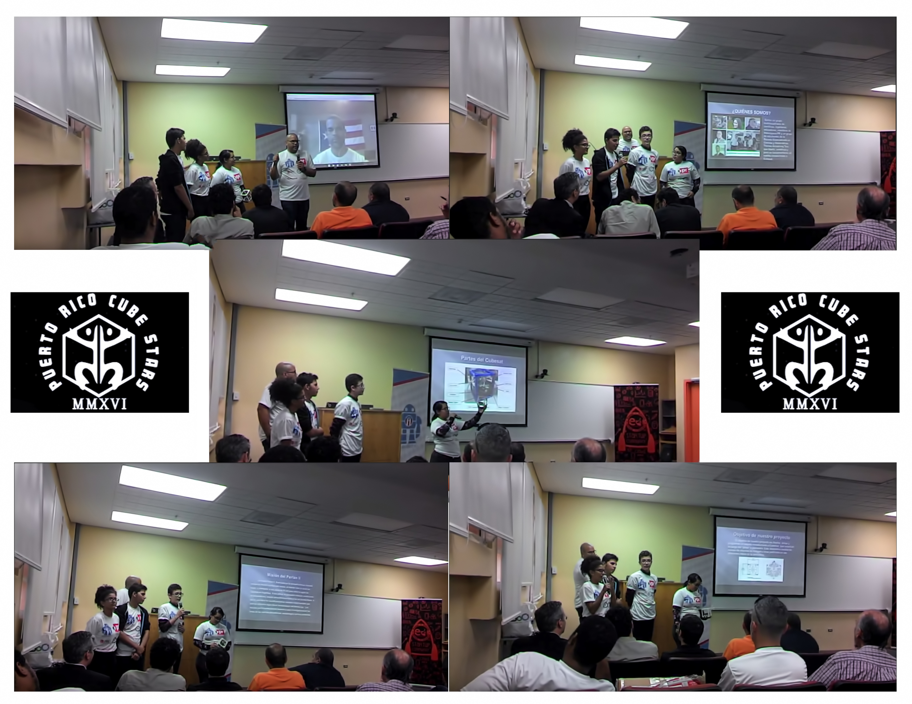

---
title: PRCubeStars Events
---  

[**Home**](https://friveramariani.github.io/PRCubeStars/) | [**Who Are PRCubeStars**](https://friveramariani.github.io/PRCubeStars/about) | [**Projects**](https://friveramariani.github.io/PRCubeStars/projects) | [**Updates**](https://friveramariani.github.io/PRCubeStars/updates) | [**The CubeSat**](https://friveramariani.github.io/PRCubeStars/cubesat) | [**Fungal Spores**](https://friveramariani.github.io/PRCubeStars/fungi)

## PRCubeStars Events

 
***(August 6th, 2017): PRCubeStars at "El Parque de las Ciencias" (The Sciences Park)***: PRCubeStars at "El Parque de las Ciencias" (The Sciences Park), in Bayamon, PR, sharing with the public their knowledge about nanosatellites (CubeSats) and talking about our team's projects and updates. El Parque de las Ciencias is one of Puerto Rico's main attactions, in which the public can learn about difference fields of sciences (find information [here](https://es-la.facebook.com/pdlcb/)).

 
***(June 2017) Graduation of one of our students: Dariel Torres***: High School Graduation of Dariel Torres, one of our students in the PRCubeStars Team. Dariel is now an engineering student at the [University of Puerto Rico - Mayagüez Campus](http://www.uprm.edu/portada/). 

***(June 25th, 2016) Dr. Yajaira Sierra-Sastre with PRCubeStars' Students***: Visit by Dr. Yajaira Sierra-Sastre to PRCubeStars' students at the Thomas Armstrong Toro High School. Dra. Sierra-Sastre, Mission Director and one of our mentors in PRCubeStars, is an expert in nanotechnology, science communicator, and expert in Mars analog missions. From left to right, students of PRCubeStars (Diego Velázquez, Dariel Torres, Diamarys Salomé, Crystal Pi), Dr. Sierra-Sastre, Mrs. Carmen Noble (one of PRCubeStars mentors and Physics Teacher at the Thomas Armstrong Toro High School), and Dámaso Cardenales-Colón (one of the mentors and computer specialists of PRCubeStars).

***(April 15th, 2016) Surprise Visit by Dr. Félix E. Rivera-Mariani***: Surprise visit by Dr. Félix E. Rivera-Marian to students of PRCubeStars. Dr. Rivera-Mariani is the Principal Investigator of the PRCubeStars (find more information [here](https://friveramariani.github.io/PRCubeStars/about)). In this image, captured by Mrs. Gina Martinez-Rivera (wife of Dr. Rivera-Mariani), students are testing the air pump and its synchronization with the progrmaming of the CubeSat's Arduino.

***(April 15th, 2016) Surprise Visit by Dr. Félix E. Rivera-Mariani***: Surprise visit by Dr. Félix E. Rivera-Marian to PRCubeStars' students at the Thomas Armstrong Toro High School. From left to right, Dr. Rivera-Mariani, Diego Velázquez, Diamarys Salomé, Mrs. Carmen Noble (Physics teacher at the Thomas Armstrong Toro High School and mentor of PRCubeStars), Crystal Pi, Dariel Torres, and Dámaso Cardenales Colón (mentor and computer specialist of PRCubeStars).

***(April 2nd, 2016) PRCubeStars' Students during the Arduino Day***: PRCubeStars' Students during a presentation during the Arduino Day at the University of Puerto Rico Mayagüez Campus. They shared with the audience, which included students, professors, computer science and engineering experts, as well as experts in the Makers movement, information about the PRCubeStar project. 

***Students Working on the CubeSat and being Mentored by Damaso Cardenales-Colón***: Find above a collage of students and mentor working on assembling and programming the CubeSat. **A)** Students receiving different parts for assembly of the CubeSat; **B)** the student Dariel Torres working on the assembly of the CubeSat's box; **C** students (Dariel Torres, in yellow shirt, next to Crystal Pi; Diego Velázquez, with grey jacket, next to Diamarys Torres) working on programming the Arduino of the CubeSat with mentor Damaso Cardenales-Colón. **D)** Diamarys and Dariel working on the assembly of our CubeSat, including the sample collector, the Arduino and sensors; **E)** the Arduino of our CubeSat. 

[Click here to return to the PRCubeStars main](https://friveramariani.github.io/PRCubeStars/)

*Copyright 2017 PRCubeStars*
