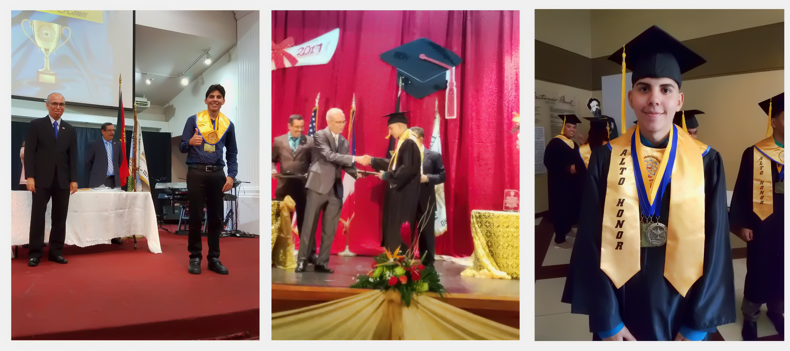
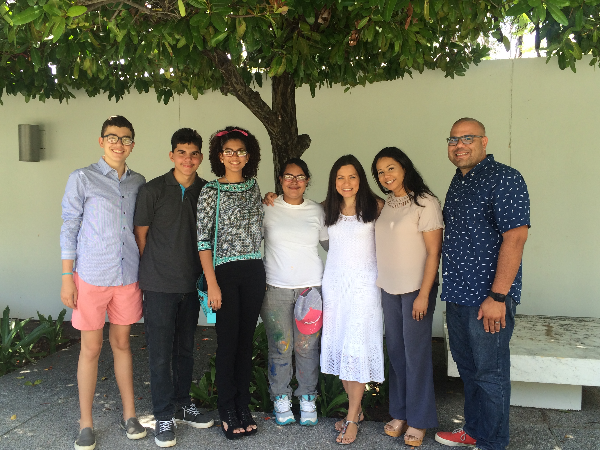
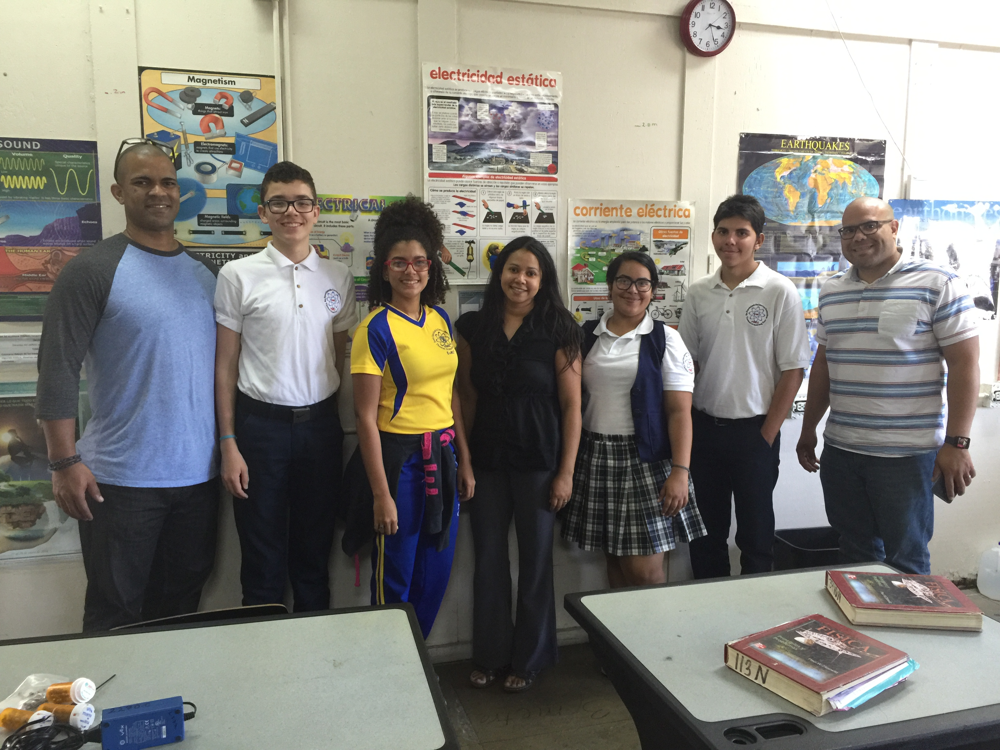

---
title: PRCubeStars Events
---  

[**Home**](https://friveramariani.github.io/PRCubeStars/) | [**Who Are PRCubeStars**](https://friveramariani.github.io/PRCubeStars/about) | [**Projects**](https://friveramariani.github.io/PRCubeStars/projects) | [**Updates**](https://friveramariani.github.io/PRCubeStars/updates) 

## PRCubeStars Events

 
#### Graduation of one of our students: Dariel Torres
**(June 2017)**: **High School Graduation** of Dariel Torres, one of our students in the PRCubeStars Team.

#### Visit of Dr. Sierra-Sastre with students of PRCubeStars
**(June 25th, 2016)**: **Visit by Dr. Yajaira Sierra-Sastre to PRCubeStars'** students at the Thomas Armstrong Toro High School. Dra. Sierra-Sastre, Mission Director and one of our mentors in PRCubeStars, is an expert in nanotechnology, science communicator, and expert in Mars analog missions. 

#### Surprise Visit by Dr. Rivera-Mariani to Students of the PRCubeStars Team
**(April 15th, 2016)**: **Surprise visit by Dr. Félix E. Rivera-Marian** to students of PRCubeStars. Dr. Rivera-Mariani is the Principal Investigator of the PRCubeStars team and expert in immunology, aerobiology, and computational biological and non-biological data analysis. 

**(April 15th, 2016)** - *Surprise visit by Dr. Félix E. Rivera-Marian to PRCubeStars' students at the Thomas Armstrong Toro High School*

#### PRCubeStars' Students during the Arduino Day at the University of Puerto Rico - Mayagüez Campus
**(April 2nd, 2016)**: **PRCubeStars' Students** during a presentation during the Arduino Day at the University of Puerto Rico Mayagüez Campus. They shared with the audience, which included students, professors, computer science and engineering experts, as well as experts in the Makers movement, information about the PRCubeStar project. 

[Click here to return to the PRCubeStars main](https://friveramariani.github.io/PRCubeStars/)

*Copyright 2017 PRCubeStars*
