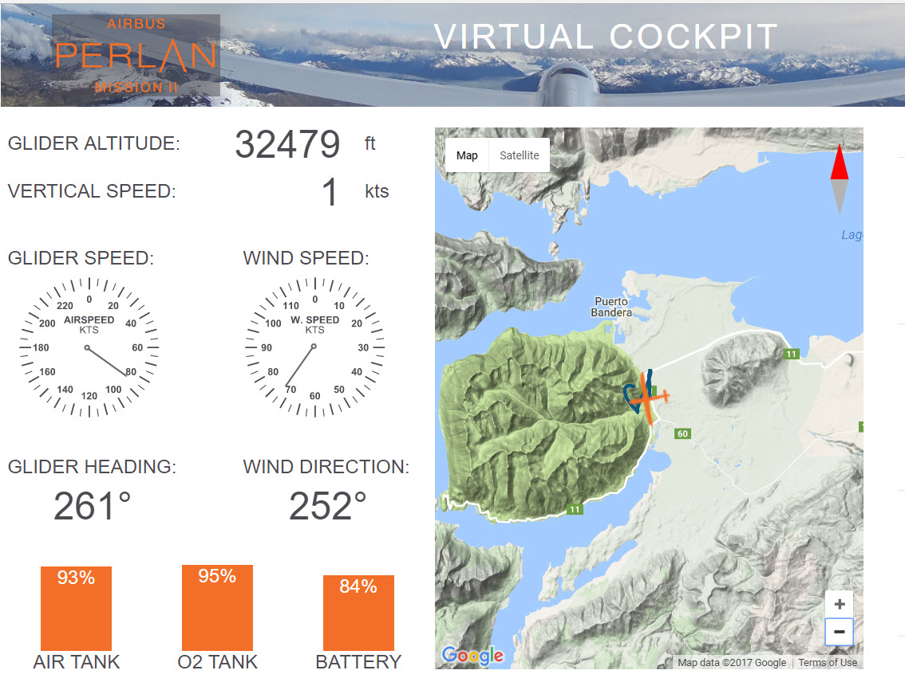
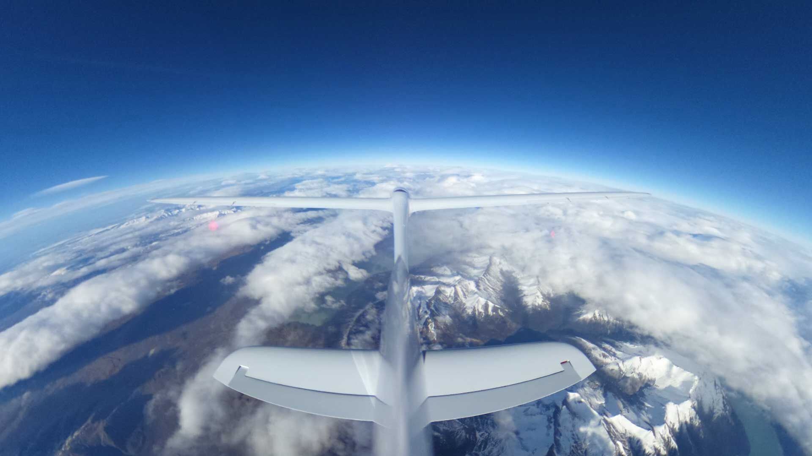
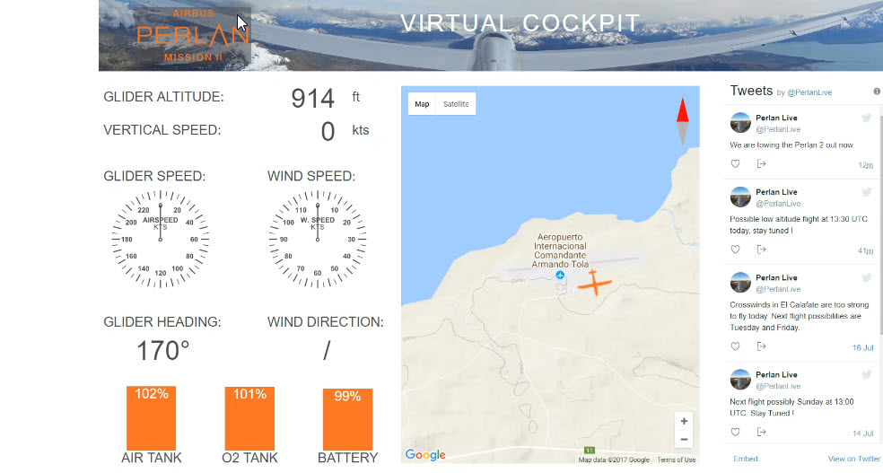
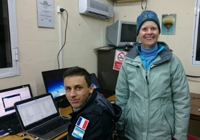
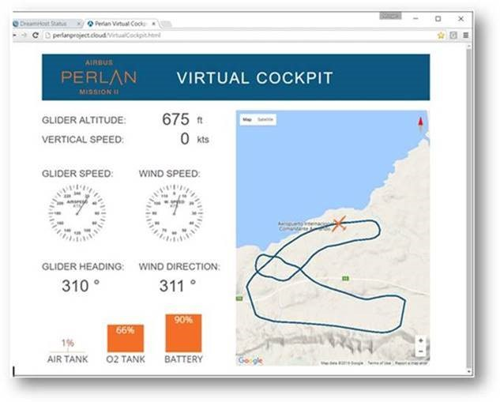
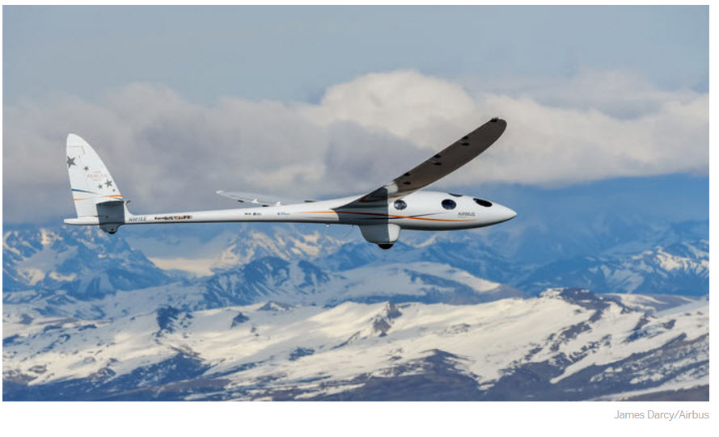
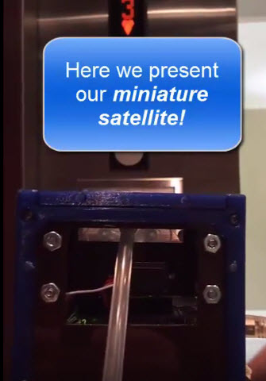

---
title: PRCubeStars News and Updates
---  

[**Home**](https://friveramariani.github.io/PRCubeStars/) | [**Who Are PRCubeStars**](https://friveramariani.github.io/PRCubeStars/about) | [**Projects**](https://friveramariani.github.io/PRCubeStars/projects) | [**Events**](https://friveramariani.github.io/PRCubeStars/images)

## PRCubeStars News and Updates

- (August 3rd, 2017) - **Virtual Cockpit recordings** of the Perlan II flight on August^3rd^, 2017. In this flight, the Perlan II reached beyond 30,000 ft above sea level 

- (August 1st, 2017) - **Perlan II at 30000** feet above sea level during a test flight.  

<iframe src="https://spark.adobe.com/video/Q5jORZtrP7Itx/embed"  width="960" height="540" frameborder="0" allowfullscreen></iframe> 
- (July 27th, 2017) - Short video with **PRCubeStars updates** 

 

- (July 24th, 2017) **Infographics** of the Perlan II glider that will be carrying our the **PRCubeStars** CubeSat into the stratosphere.  

- (July 18th, 2017) **Virtual Cockpit** of a Low-Altitude Test Flight of the Perlan II. 

- (July 17th, 2017) **Members of Perlan Project**, located in the Calafate Region in the south region of Argentina. This is the site from where the Perlan Project glider will be making its flights.  

**Virtual Cockpit** of the Perlan Glider that will be flying the PRCubeStars CubeSat. Click on the image below.  

- (June 14th, 2017) The **Perlan Project's** glider that will be carrying our CubeSat into the stratosphere has arrived in Argentina. Testing flights will begin in the upcoming weeks. Click [here](http://www.sciencemag.org/news/2017/07/glider-aims-new-heights-and-rare-scientific-data?platform=hootsuite) for information about the Perlan Project. 

- (April 30th, 2017) **Video of the Altimeter** Sensor Testing Experiment of the CubeSat*.  

[Click here to return to the PRCubeStars main page](https://friveramariani.github.io/PRCubeStars/)

*Copyright 2017 PRCubeStars*