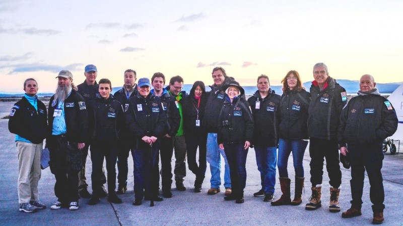
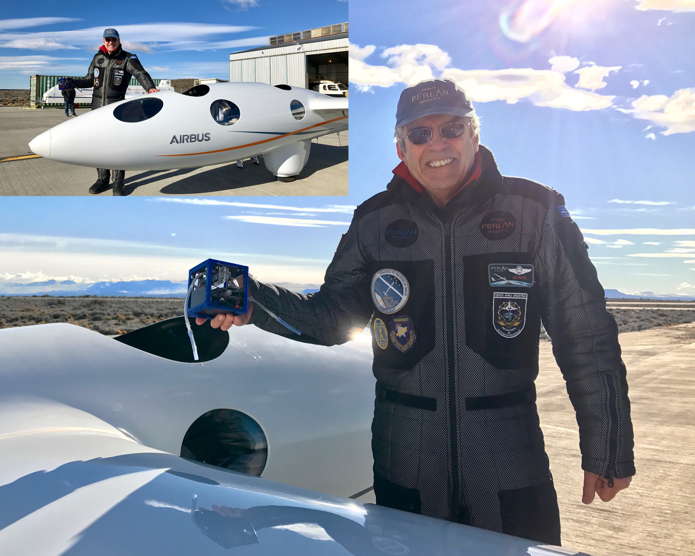
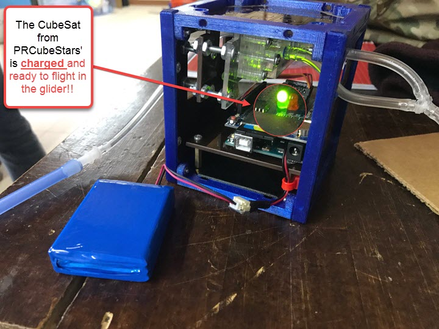

---
title: Welcome to the PRCubeStars News and Updates
---  

[**Home**](https://friveramariani.github.io/PRCubeStars/) | [**Who Are PRCubeStars**](https://friveramariani.github.io/PRCubeStars/about) | [**Projects**](https://friveramariani.github.io/PRCubeStars/projects) | [**Events**](https://friveramariani.github.io/PRCubeStars/images) | [**The CubeSat**](https://friveramariani.github.io/PRCubeStars/cubesat) | [**Fungal Spores**](https://friveramariani.github.io/PRCubeStars/fungi)

## PRCubeStars News and Updates

 
***The Perlan Project Team***: Find above colleagues of the Perlan Project team. At the moment of posting this picture, they are currently in the city of Calafate, in the south region of Argentina, carrying out flights with the Perlan II glider. **(August 20th, 2017)**

<iframe width="560" height="315" src="https://www.youtube.com/embed/07enO0GLpBI" frameborder="0" allowfullscreen></iframe>
***PRCubeStars made history during the August 15th, 2017 Perlan II flight***: The August 15th, 2017 flight of the Perlan II glider was a historic one for the PRCubeStars team: our nanosatellite (CubeSat) was able to sample air above 33,000 feet of altitude while in extreme conditions (-58ºF), the coding of the arduino executed accordingly, the valve was able to change sampling angles as instructed by the code, and the altimeter was able to record sampling altitudes. Soon we will be receiving our sample collectors and implement microbiological techniques to detect fungal spores in the stratospheric samples.  

 
***PRCubeStars CubeSat with Chief Pilot of Perlan II glider Jim Payne***: Post-flight pictures of the PRCubeStars CubeStat with Chief Pilot of the Perlan II Project glider Jim Payne. Today, **August 15th, 2017**, our CubeStat was in the cargo of the glider. Also, the glider was able to set a new altitude mark during this summer's flight campaing by reaching above 33,000 feet. As per Perlan II members, PRCubeStars CubeSat has been the highest among all CubeSats to date!. **(August, 15th, 2017)**

***PRCubeStars' CubeSat is charged***: The CubeSat from PRCubeStars has been charged, and will be in the cargo of upcoming flights of the Perlan II glider. (August 8th, 2017)

***[Summary by MicroNow](https://micronow.org/science/analyzing-the-stratospheres-fungal-microbiome/)***: Excellent summary of the PRCubeStars story shared by the [American Society for Microbiology](https://www.asm.org/) through their recently-developed website [MicroNow](https://micronow.org/), which is dedicated to curating and aggregating information related to microbial sciences. (August 4th, 2017)

***August 3rd Perlan II flight***: Virtual Cockpit recordings of the Perlan II flight on August 3rd, 2017. In this flight, **the Perlan II reached, again, an altitude beyond 30,000 ft above sea level**. (August 3rd, 2017)

***1st Perlan II flight: above 30000 feet***: **Perlan II flight** reached above 30000 feet above sea level during a test flight. (August 1st, 2017)

<iframe src="https://spark.adobe.com/video/Q5jORZtrP7Itx/embed"  width="560" height="315" frameborder="0" allowfullscreen></iframe> 
***Video updates of PRCubeStars***: Find here a **short video of the PRCubeStars**, in which we share information about who we are (to refresh your memory), including students and mentors, the mission of the project, and experiments we have been able to carry out so far. **Enjoy the video!** (July 27th, 2017)

***Infographics of the montain waves***: Infographics of the Perlan II glider that will be carrying our the **PRCubeStars** CubeSat into the stratosphere. 

***Virtual Cockpit during low-altitude test flight***: Virtual Cockpit of a low-altitude test flight of the Perlan II. These tests flights are being carried out in [Calafate, located in the south region of Argentina](https://en.wikipedia.org/wiki/El_Calafate).

    
***Members of the Perlan II Project***: Some of the **Members of Perlan Project**, which are carrying out test flights of the Perlan II glider in Calafate, Argentina. (July 17th, 2017)

  

***Virtual Cockpit of the Perlan II Glider***: This is the **Virtual Cockpit** of the Perlan II Glider, which will report flight information during test flights of the glider, including altitude, wind speed, Google Map of the flight direction and location, among others.

***Perlan II Glider***: The **Perlan II glider** that will be carrying our CubeSat into the stratosphere has arrived in Argentina. Testing flights will begin in the upcoming weeks. Click [here](http://www.sciencemag.org/news/2017/07/glider-aims-new-heights-and-rare-scientific-data?platform=hootsuite) for information about the Perlan II Project. 

    
***Altimeter Testing of the PRCubeStars CubeSat***: **Video of the Altimeter Sensor** testing experiment of the CubeSat. This experiment was carried out in an elevator of a building in the state of Maryland, where two of our mentors (Dr. Yajaira Sierra-Sastre and electrical engineer Daron Westly) work and live. (April 30th, 2017)

[Click here to return to the PRCubeStars main page](https://friveramariani.github.io/PRCubeStars/)

*Copyright 2017 PRCubeStars*