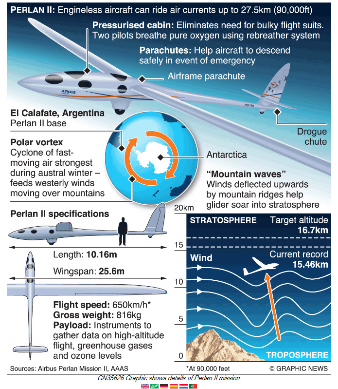

---
title: PRCubeStars News and Updates
---  

[**Home**](https://friveramariani.github.io/PRCubeStars/) | [**Who Are PRCubeStars**](https://friveramariani.github.io/PRCubeStars/about) | [**Projects**](https://friveramariani.github.io/PRCubeStars/projects) | [**Events**](https://friveramariani.github.io/PRCubeStars/images) | [**The CubeSat**](https://friveramariani.github.io/PRCubeStars/cubesat) | [**Fungal Spores**](https://friveramariani.github.io/PRCubeStars/fungi)

## PRCubeStars News and Updates

#### [Analyzing the Stratosphere’s Fungal Microbiome](https://micronow.org/science/analyzing-the-stratospheres-fungal-microbiome/)
**(August 4th, 2017)**: **Excellent summary** of the PRCubeStars story shared by the [American Society for Microbiology](https://www.asm.org/) through their recently developed website [MicroNow](https://micronow.org/), which is dedicated to curating and aggregating information related to microbial sciences. 

#### August 3rd Perlan II flight
**(August 3rd, 2017)**: **Virtual Cockpit recordings** of the Perlan II flight on August 3rd, 2017. In this flight, the Perlan II reached, again, an altitude beyond 30,000 ft above sea level. 

#### August 1st Perlan II flight: above 30000 feet
**(August 1st, 2017)**: **Perlan II flight**, in which for the first time this summer reaching above 30000 feet above sea level during a test flight.

<iframe src="https://spark.adobe.com/video/Q5jORZtrP7Itx/embed"  width="960" height="540" frameborder="0" allowfullscreen></iframe> 
#### Video updates of PRCubeStars
**(July 27th, 2017)**: Find here a **short video of the PRCubeStars**, in which we share information about who we are (to refresh your memory), including studetns and mentors, what is the mission of the project, and experiments we have been able to carry out so far. **Enjoy the video!**

#### Infographics of the montain waves 
**(July 24th, 2017)**: **Infographics** of the Perlan II glider that will be carrying our the **PRCubeStars** CubeSat into the stratosphere. 

#### Virtual Cockpit during low-altitude test flight
**(July 18th, 2017)**: **Virtual Cockpit** of a low-altitude test flight of the Perlan II. These tests flights are being carried out in [Calafate, located in the south region of Argentina](https://en.wikipedia.org/wiki/El_Calafate).

#### Members of the Perlan II Project
**(July 17th, 2017)**: Some of the **Members of Perlan Project**, which are carrying out test flights of the Perlan II glider in Calafate, Argentina.  

  

#### Virtual Cockpit of the Perlan II Glider
This is the **Virtual Cockpit** of the Perlan II Glider, which will report flight information during test flights of the glider, including altitude, wind speed, Google Map of the flight direction and location, among others.

#### Perlan II Glider
**(June 14th, 2017)**: The **Perlan II glider** that will be carrying our CubeSat into the stratosphere has arrived in Argentina. Testing flights will begin in the upcoming weeks. Click [here](http://www.sciencemag.org/news/2017/07/glider-aims-new-heights-and-rare-scientific-data?platform=hootsuite) for information about the Perlan II Project. 

#### Altimeter Testing of the PRCubeStars CubeSat
**(April 30th, 2017)**: **Video of the Altimeter Sensor** testing experiment of the CubeSat. This experiment was carried out in an elevator of a building in the state of Maryland, where two of our mentors (Dr. Yajaira Sierra-Sastre and electrical engineer Daron Westly) work and live.   

[Click here to return to the PRCubeStars main page](https://friveramariani.github.io/PRCubeStars/)

*Copyright 2017 PRCubeStars*